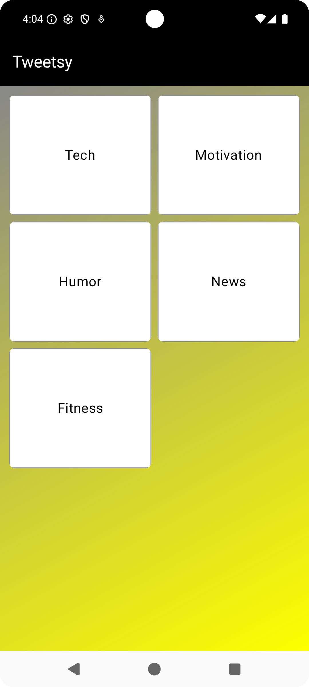
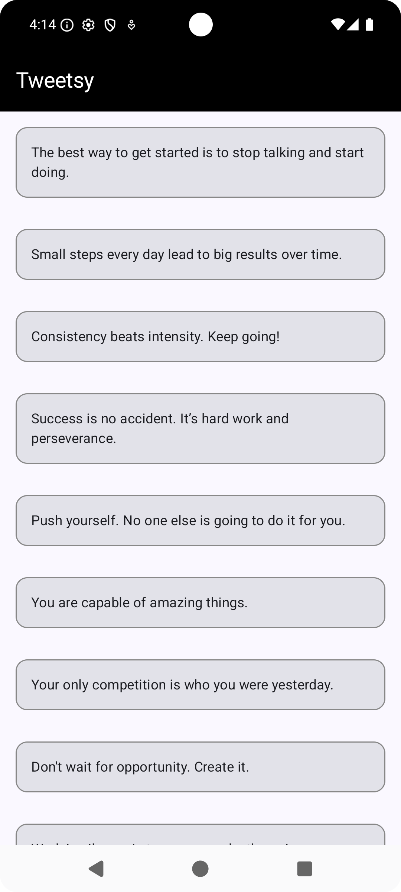

# 🐦 Tweetsy

A minimal Android app built using **Jetpack Compose** following the **MVVM architecture**.

### 🔧 Tech Stack
- **Jetpack Compose**
- **Navigation Component**
- **HILT** for Dependency Injection
- **MVVM Pattern**

### 📱 Features
- Clean architecture for quick scaling
- Compose-based UI with modern best practices
- Easy-to-navigate codebase — perfect for beginners and interview prep!

## 🔥 Category Screen

## 🔥 Details Screen

